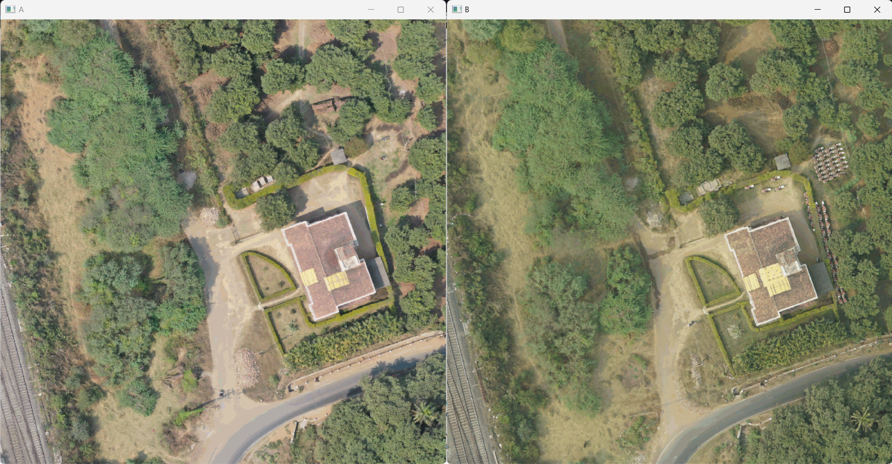
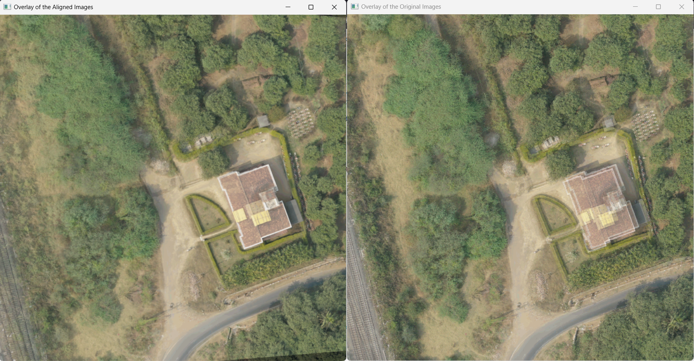
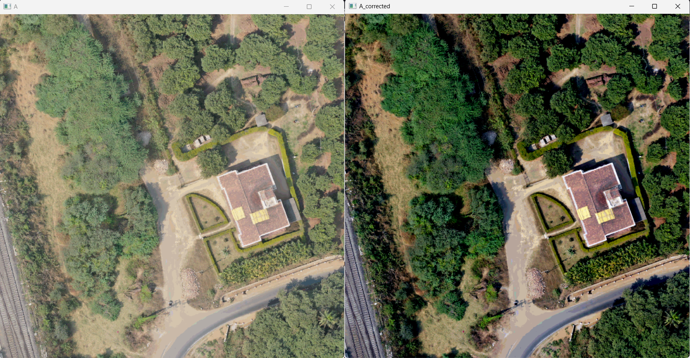
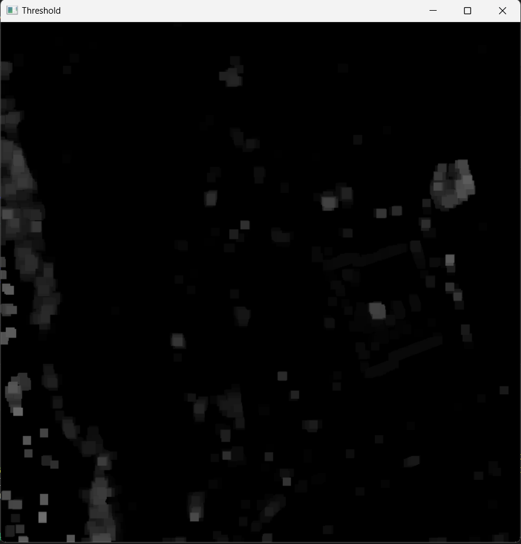
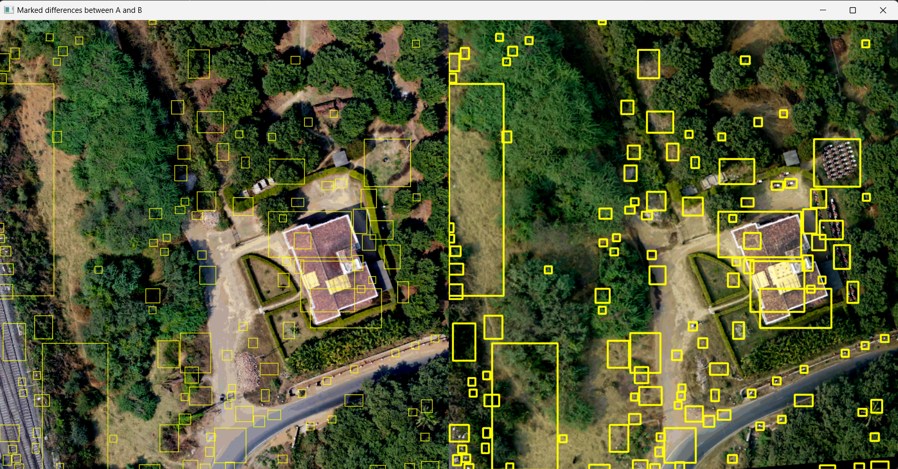
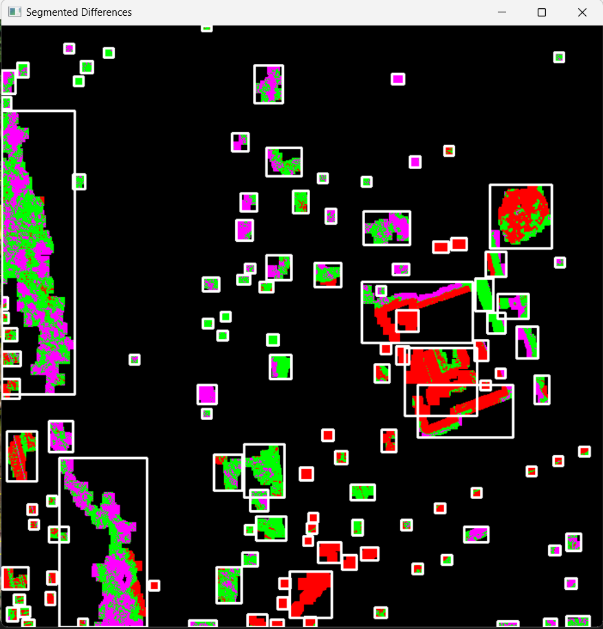

# Change_Detection_And_Segmentation

## Intro
This repository implements an image analysis pipeline for analyzing changes between two ortho-rectified images of the same geographical area.

The pipeline comprises several key steps:

* <b>Alignment:</b> The ORB (Oriented FAST and Rotated BRIEF) algorithm is employed for feature-based keypoint detection. Further, a homography matrix is created to wrap one of the image over other for aligining both the images.
* <b>Environmental Correction:</b> To account for variations caused by factors like time, season, or atmospheric conditions, the dark channel prior algorithm is implemented. This step normalizes the images and minimizes environmental influence on change detection.
* <b>Change Detection:</b> Morphological operations are applied to emphasize image differences and highlight potential change regions, facilitating the identification of areas with changes.
* <b>Change Segmentation:</b> Following change detection, the K-means clustering algorithm is used to categorize the identified changes into distinct classes. 

## Results

* <b>Original Images:</b>

* <b>Keypoint Matching:</b>

* <b>Comparison of Overlay of the Aligned Images and the Original Images:</b>

* <b>Environmental Haze correction using the DCP Algorithm:</b>

* <b>Changes template post morphological operations and thresholding:</b>

* <b>Marked Changes:</b>

* <b>Unsupervised Segmentation (Using K-Means):</b>

## Author
Suyash Mali